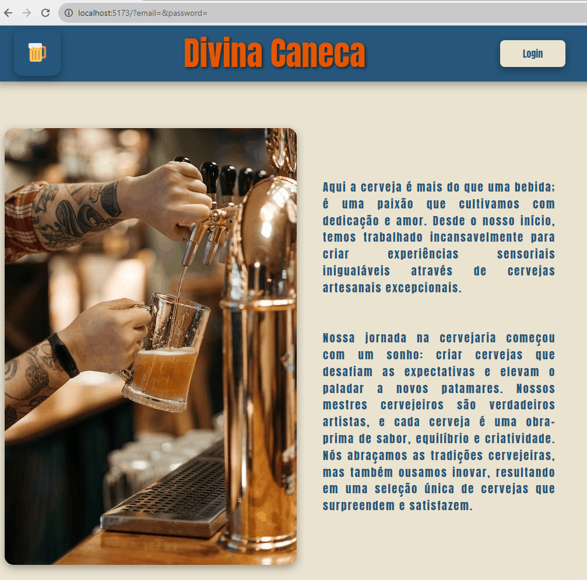

<div style="display: flex; align-items: center; justify-content: center">

</div>

# Divina Caneca Cervejaria

## Descrição

Este projeto apresenta a página inicial da cervejaria `Divina Caneca`. Nela o usuário poderá fazer o login ou cadastro para acessar as cervejas disponíveis. A página inicial está responsiva permitindo que seja aberta tanto em dispositivos móveis como computador.

O projeto foi desenvolvido com React utilizando [Typescript](https://www.typescriptlang.org/), [Vite](https://vitejs.dev/) e [React Hook Forms](https://react-hook-form.com/).

## Instalação

```bash
$ npm install
```

## Rodando o app

```bash

# development
$ npm run dev

```
O servidor irá iniciar em `http://localhost:5173/`.

## Resultado



## TODO
```
1. Integração com o backend;
2. Página das cervejas.
```


## Tecnologias utilizadas

[](https://skillicons.dev)

## Contato

- Autora - [Daiane Bolzan](https://www.linkedin.com/in/daiane-deponti-bolzan/)

## License

[MIT licensed](LICENSE).